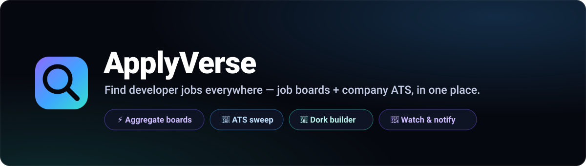
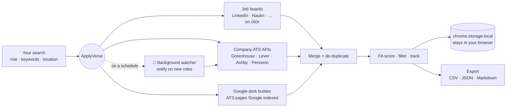
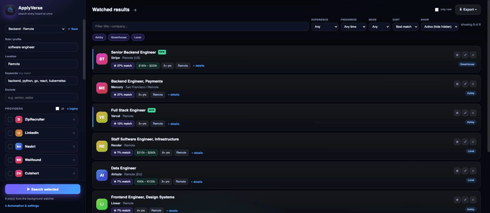
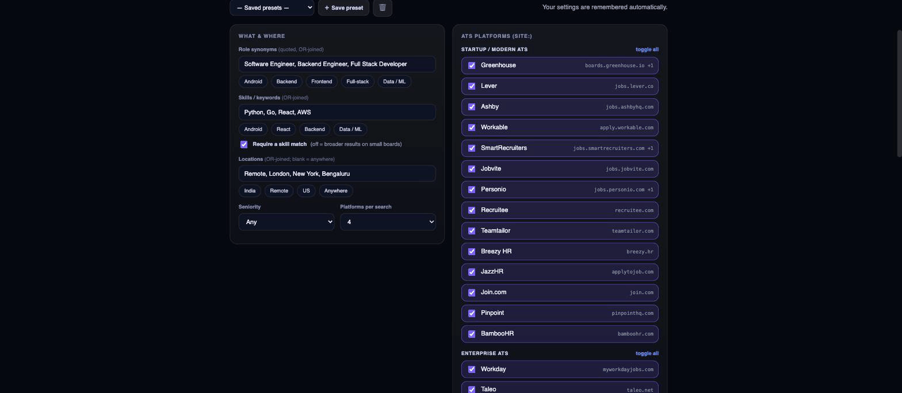

<p align="center">
  
</p>

<p align="center">
  <a href="https://github.com/theabhishekchandra/ApplyVerse/actions/workflows/ci.yml"></a>
  
  
  <a href="LICENSE"></a>
  <a href="CONTRIBUTING.md"></a>
  <a href="https://github.com/theabhishekchandra/ApplyVerse/releases/latest"></a>
</p>

<p align="center">
  <b>ApplyVerse</b> is a Chrome extension that finds developer jobs across job boards
  <em>and</em> company career portals — aggregating, de-duplicating, fit-scoring, and
  watching for new roles, all in one place. No server, no build step, everything
  stays in your browser.
</p>

<p align="center">
  <a href="#-quick-start">Quick start</a> ·
  <a href="#-features">Features</a> ·
  <a href="#-how-it-works">How it works</a> ·
  <a href="#-screenshots">Screenshots</a> ·
  <a href="#-account-safety">Account safety</a> ·
  <a href="CONTRIBUTING.md">Contributing</a>
</p>

---

## ✨ Why ApplyVerse

Aggregators only index a slice of the jobs that are actually open — a huge number
live only on each company's **applicant tracking system** (Greenhouse, Lever,
Ashby…). ApplyVerse pulls from **both worlds** and unifies them:

- 🔀 **One merged, de-duplicated list** across every source — a job posted to five
  boards collapses to one row with all its sources.
- 🎯 **Company-ATS sweep** — reads companies' **public career APIs** directly (no
  login, no tabs, no scraping) to surface roles that never reach the aggregators.
- 🔎 **Google-dork builder + one-click Auto-collect** — finds ATS pages Google
  indexed, pulls their full listings, and stores them like the sweep.
- 🔔 **Background watcher** — runs the ATS sweep on a schedule and pings you with a
  desktop notification + toolbar badge when **new** roles appear.
- ⭐ **Fit-scoring, filtering & apply-tracking** — rank by match, filter by
  experience / work-mode / freshness, mark jobs Saved / Applied / Hidden.
- 📤 **Export** to CSV, JSON, or Markdown (paste straight into Notion).

## 🚀 Quick start

### Install from a release (recommended)

1. Download the latest **`applyverse-<version>.zip`** from the
   [**Releases**](https://github.com/theabhishekchandra/ApplyVerse/releases/latest) page.
2. Unzip it — you get an **`applyverse`** folder.
3. Open **`chrome://extensions`** → turn on **Developer mode** (top-right).
4. Click **Load unpacked** → select the **`applyverse`** folder.
5. Pin the 🔎 ApplyVerse icon and click it to start.

> Detailed steps for non-technical users: [`extension/INSTALL.md`](extension/INSTALL.md).

### Run from source

```bash
git clone https://github.com/theabhishekchandra/ApplyVerse.git
# chrome://extensions → Developer mode → Load unpacked → select the extension/ folder
```

It's plain HTML/CSS/JS — **no `npm install`, no bundler, no build step**. Edit a
file, hit **↻ reload** on the extension card. Build a shareable zip anytime with
`bash extension/scripts/pack.sh`.

## 🧩 Features

| | Feature | What it does |
|---|---|---|
| 🔀 | **Aggregate** | Search many job boards at once; results merge into one de-duplicated table. |
| 🎯 | **ATS sweep** | Pulls jobs straight from Greenhouse / Lever / Ashby / Personio public APIs. |
| 🔎 | **Dork builder** | Builds targeted Google searches for company ATS pages, then **Auto-collects** and stores them. |
| ⭐ | **Fit score** | Ranks each job by how well it matches your role + keywords. |
| 🧪 | **JD enrichment** | Mines salary & experience from each posting's full description (free, no extra request). |
| 🧰 | **Filter & sort** | Experience, work-mode, freshness, source chips, best-match sort — all client-side. |
| ✅ | **Apply-tracking** | Mark jobs Saved / Applied / Hidden; state persists across runs. |
| 🔔 | **Watch & notify** | Scheduled background sweep + desktop notifications + count badge for new roles. |
| 📤 | **Export** | CSV, JSON, Markdown (Notion-ready), or copy for Sheets/Excel. |

## 🛠 How it works



- **`extension/`** — the Chrome extension (Manifest V3). `popup` for single-site
  scraping, `results` for the unified dashboard, `dorks` for the builder,
  `options` for the watcher, `background.js` for scheduled sweeps.
- **`ats.js` / `sites.js`** — the ATS providers and job-board scrapers (extend these
  to add sources — see [`docs/ATS-AND-DORKS.md`](docs/ATS-AND-DORKS.md)).
- **`finders/`** — the original standalone **browser-console scripts** the extension
  grew out of; still usable by pasting into DevTools.

## 📸 Screenshots

<p align="center"></p>

> **Want product screenshots here?** Load the extension (2 min, above), open the
> **Search all** dashboard, and drop your images into `docs/images/` as
> `dashboard.png`, `dork-builder.png`, and `watched.png` — then uncomment the block
> below. (Screens are omitted from the repo by default to keep it light.)

<!--
| Unified dashboard | Dork builder | Watched results |
|---|---|---|
|  |  |  |
-->

## 🛡 Account safety

ApplyVerse is built to be polite and to **not put your accounts at risk**:

- The **background watcher only calls public, no-account ATS APIs** — it never
  touches a logged-in site, so scheduled runs can't affect your LinkedIn/Naukri/etc.
- **DOM scrapers run only when you click**, are **human-paced with jittered delays**
  and modest caps, and **stop on the first non-200** rather than hammering a site.
- **Never bypasses or solves CAPTCHAs** — it detects them and stops.
- **No credentials, ever.** Nothing is collected or sent to any server;
  everything lives in `chrome.storage.local`.

Read the boundaries in full in [`CONTRIBUTING.md`](CONTRIBUTING.md) — every PR must
respect them.

## 🤝 Contributing

Contributions are welcome — bug fixes, new job boards, new ATS providers, UI polish,
and docs. Start with **[CONTRIBUTING.md](CONTRIBUTING.md)** (dev setup, project
layout, conventions, and the account-safety rules).

- 🐛 Bug or 💡 feature → open an issue (templates provided).
- 🔒 Security issue → **[SECURITY.md](SECURITY.md)** (report privately).
- 🤝 Be kind → **[CODE_OF_CONDUCT.md](CODE_OF_CONDUCT.md)**.

## 📄 License

[MIT](LICENSE) — by contributing you agree your contributions are MIT-licensed.
